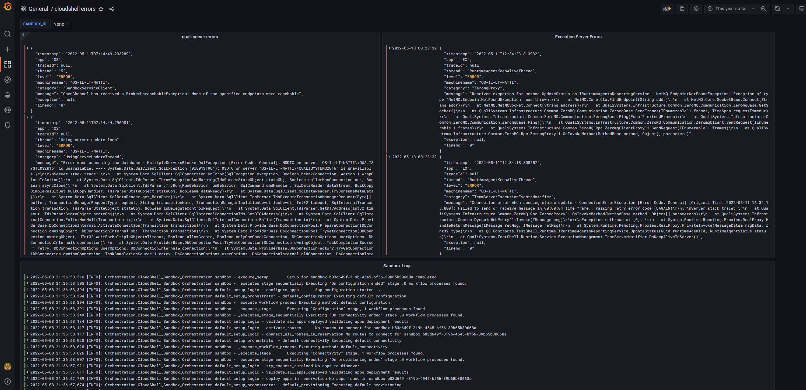
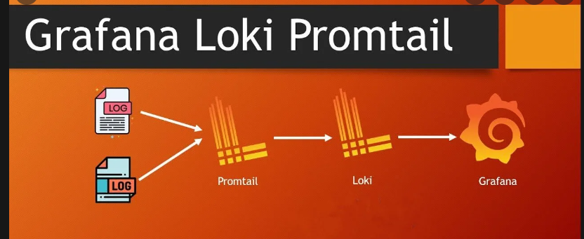
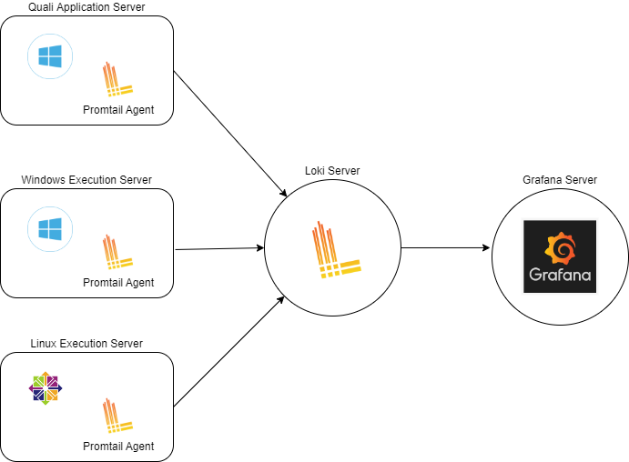
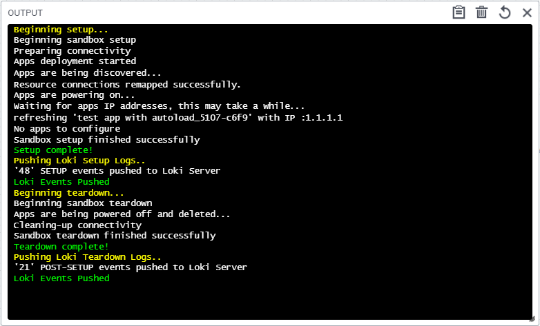
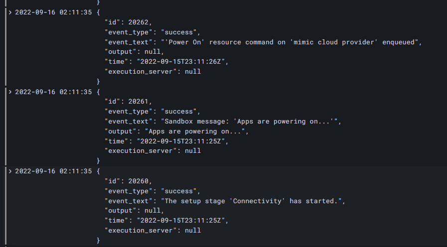
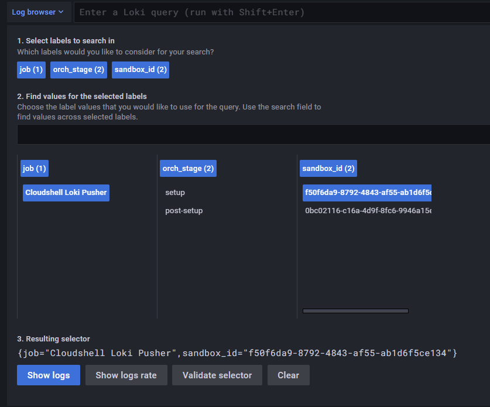
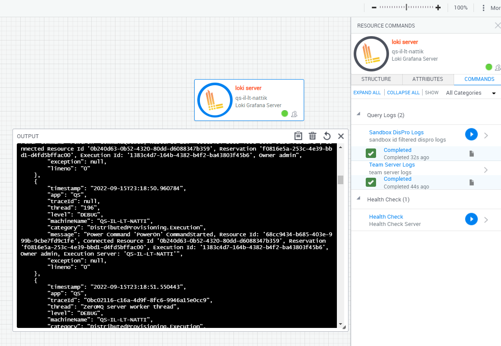
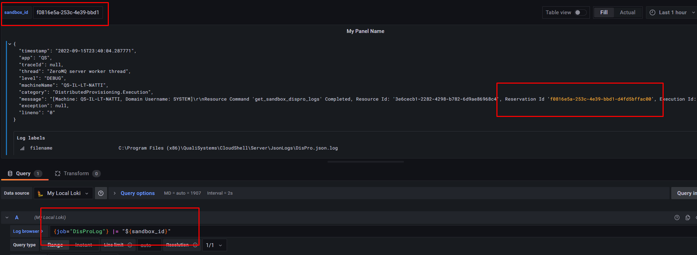

# Cloudshell Loki-Grafana Centralized Logging 
This repo documents a sample implementation of cloudshell centralized logging with Grafana / Loki / Promtail stack.

Cloudshell outputs JSON logs that can be ingested into centralized logging tools such as Elastic / Loki.
Centralized Logging is beneficial for tracking sandbox events that can occur across multiple servers.

Read more on cloudshell centralized logging in [help article](https://help.quali.com/Online%20Help/0.0/Portal/Content/IG/CentralLog/central-logging-overview.htm?Highlight=centralized%20logging).

### Sample Grafana Log Dashboard

## Solution Architecture
Grafana provides dashboard UI, Loki is the backend logging aggregator, Promtail agent installed on all Quali components.
These components are analagous to elastic stack components of Elastic / Kibana / Filebeat.

Standard Loki Architecture:

Cloudshell Integration:

## Setup and Usage
1. Configure cloudshell JSON logs by following along with [Quali help article](https://help.quali.com/Online%20Help/0.0/Portal/Content/IG/CentralLog/central-logging-overview.htm?tocpath=Installation%20and%20Configuration%7CCloudShell%20Suite%7CCentral%20Logging%20Configuration%7C_____0)
2. Set up Grafana Server (see [Grafana help article](https://grafana.com/docs/grafana/latest/setup-grafana/installation/))
3. Set up Loki Server. This can be done with [local binary install](https://grafana.com/docs/loki/latest/installation/local/) or [docker installation](https://grafana.com/docs/loki/latest/installation/docker/)
4. Install Promtail agent on Quali components by downloading and adding the Promtail binary file to each server. See [Grafana help article](https://grafana.com/docs/loki/latest/clients/promtail/installation/) and get correct binary from grafana [github release page](https://github.com/grafana/loki/releases)
5. Configure Loki Server config yaml in same directory as binary. 
   - See [sample Loki config](loki-promtail/loki-windows-amd64/loki-local-config.yaml) and run Loki exe.
   - Run [sample bat file](loki-promtail/loki-windows-amd64/run_loki.bat) to run exe
   - See [Grafana help](https://grafana.com/docs/loki/latest/configuration/) for reference.
6. Configure Promtail config yaml to scrape the target logs and run agent. 
   - See [sample Promtail config](loki-promtail/promtail-windows-amd64/promtail-local-config.yaml)
   - Run [sample bat file](loki-promtail/promtail-windows-amd64/run_promtail.bat) to run service
7. Configure Loki as data source in Grafana. See [Grafana help](https://grafana.com/docs/grafana/latest/datasources/loki/)
8. Customize dashboards
9. Add cloudshell Loki service to cloudshell, which gives option to optionally present loki data from sandbox via Loki API calls

## Push Sandbox Events To Loki
An alternative workflow to promtail monitoring of log files, is to push data directly into Loki. 
A good candidate workflow is to pull sandbox activity events and push directly into Loki without need for intermediary files. 
A custom "Loki Server" shell with these commands is included.

Solution Flow:
1. At end of sandbox setup, pull sandbox events with [sandbox api call](https://help.quali.com/Online%20Help/0.0/Portal/Content/API/RefGuides/Sndbx-REST-API/REST-API-V2-Ref-Guide.htm?Highlight=sandbox%20api#sandbox10).
2. Store latest sandbox event in sandbox data, push setup events data into Loki
3. At end of teardown, read last cached event id in sandbox data and make api call to gather remaining events
4. Push Post-setup events into Loki

sample flow output:

sandbox events in grafana:

log browser labels:

### Setup and Usage Info
1. Import "Loki Server" Shell and create resource
2. Add all relevant attribute data to Loki Server Shell
   - Loki Server Details (for talking to Loki)
   - Sandbox Api Details (for pulling sandbox events)
3. Loki Server resource does NOT have to be in sandbox, but does have to be in same cloudshell domain
4. Customize Setup / Teardown to trigger proper command on shell. See examples in orchestration folder

## Loki Server Shell In Sandbox
Dashboards can be explored in Grafana, or Loki shell can be triggered directly from sandbox to query select target logs.

Sample command pulling Dispro Quali Server logs:

## Customizing LogQL Queries
Loki / Grafana uses LogQL syntax which can allow to target job labels, or filter by target json field of logs.

sample filter to pull "dispro" logs of a target sandbox ID:
`{job="qualiserver"} | json | category="DistributedProvisioning.Execution" |= "b83d649f-319b-4545-bf56-39b65b30668a"`

Pull sandbox setup via wildcard filter:
`{filename=~".*b83d649f-319b-4545-bf56-39b65b30668a.*Setup.*",job="sandboxlogs"}`

Pass in top Level sandbox id variable into dashboard queries:

## References and Articles
- [Grafana Loki High Level Intro](https://youtu.be/1obKa6UhlkY)
- [Install blog](https://reachmnadeem.wordpress.com/2020/12/30/log-scrapping-made-easy-with-grafana-loki-in-windows/)
- [LogQL Syntax](https://grafana.com/docs/loki/latest/logql/log_queries/)
- [Push To Loki Article](https://medium.com/geekculture/pushing-logs-to-loki-without-using-promtail-fc31dfdde3c6)
- [Grafana Variables](https://stackoverflow.com/a/69891457)
